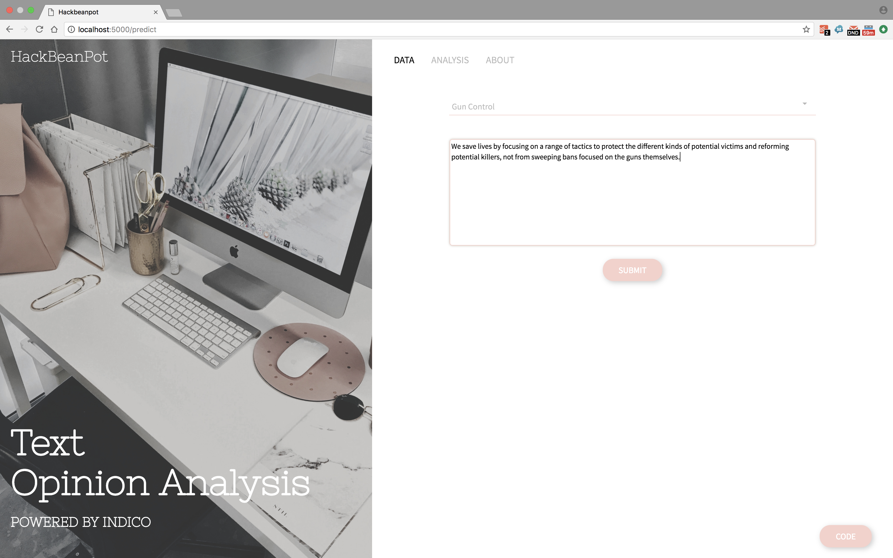
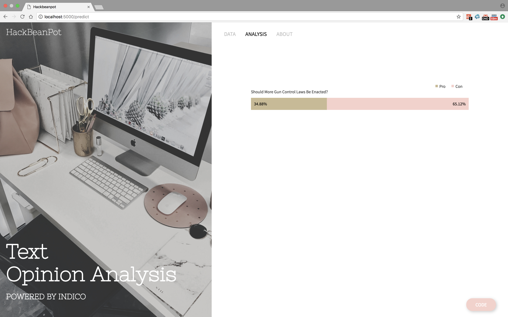

# Hackbeanpot 2k18 Project

## About

We approached this hackathon project by considering how the indico.io API could be used to compare opposing viewpoints on various divisive topics. Ultimately, we decided to use indico.io’s “Custom Collections” feature, which allowed us to train a model on for/against arguments from procon.org, as well as various other sources. This let us input text to predict whether it was for or against a given argument.

**Tech stack:**
* Python
* Flask
* Indico.io API
* HTML/CSS
* Sass, jQuery

## Team
**Developers**:
* [Crystal Rhee](https://github.com/crystalrhee)
* [Olivia Wan](https://github.com/omwan)
* [Sarah Zhang](https://github.com/sazhang)

## Starting a local server:
1. Clone the repo  
2. Add a `config.py` file to the project directory and set a secret key for CSRF as follows:
```
app.config["SECRET_KEY"] = <your key>
```
3. Get an indico.io API key and add it to your home directory in an .indicorc file as explained in the [indico.io docs](https://indico.io/docs#config_file).  
4. cd into the project repo and run `python app.py`  
5. In the browser, open http://localhost:5000/predict  

## Screenshots:
  

